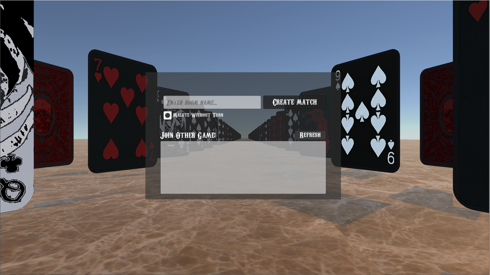
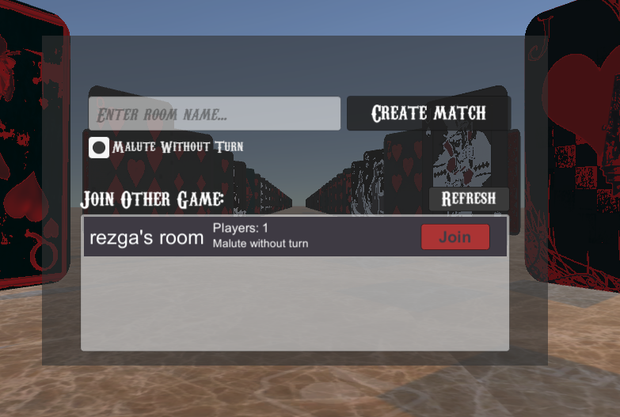
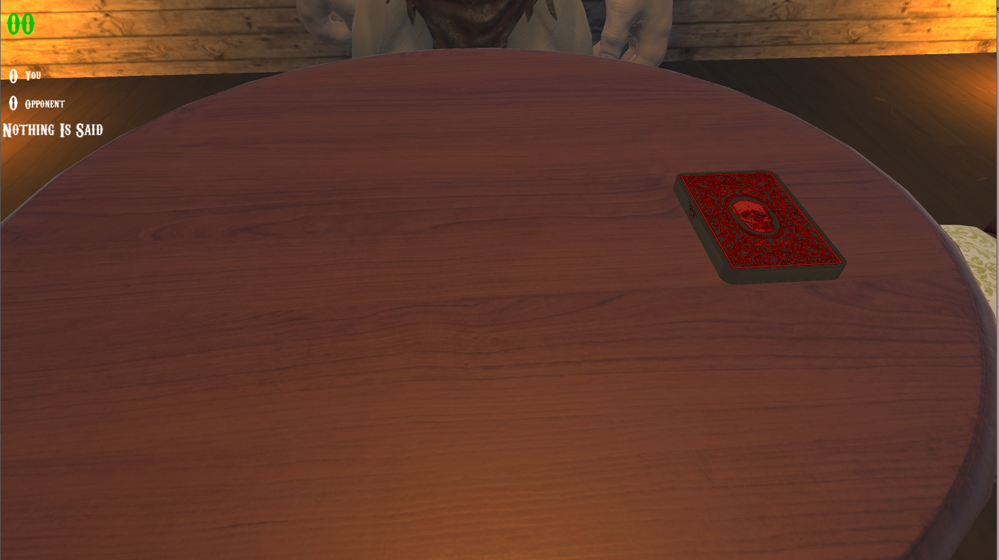
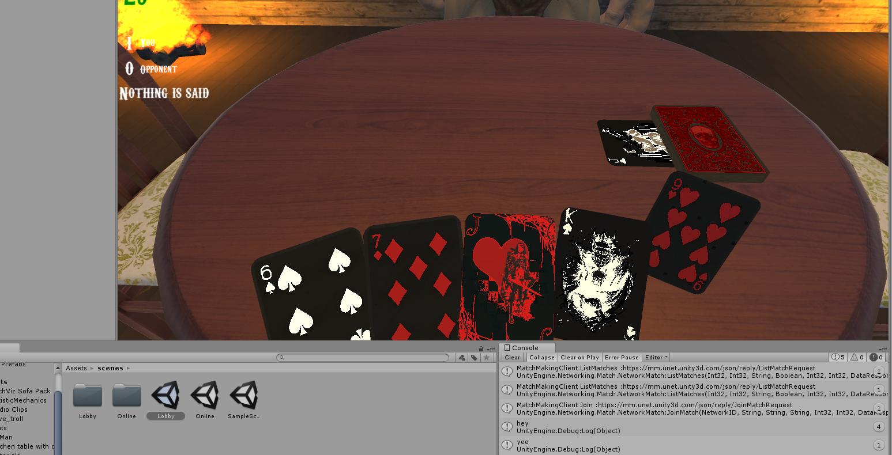
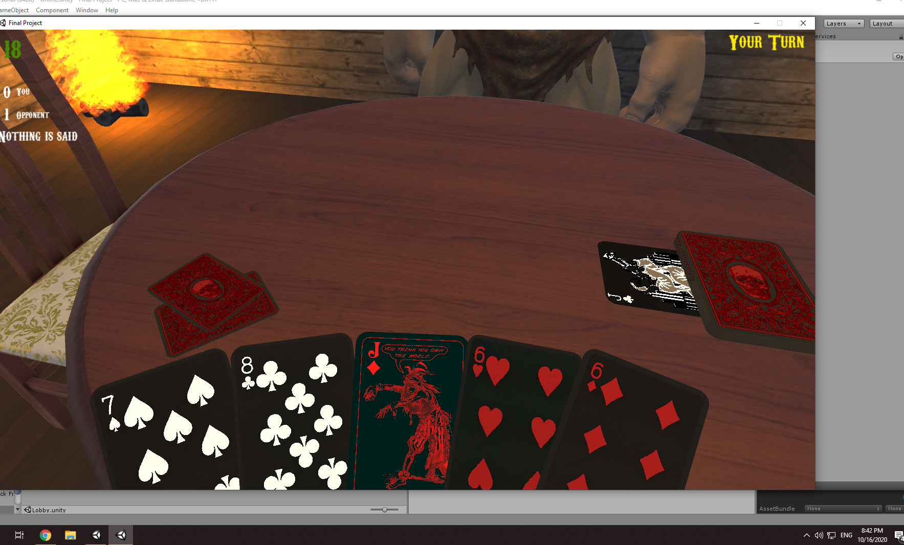
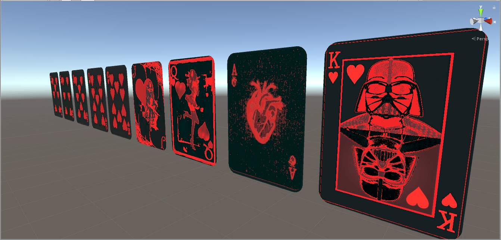
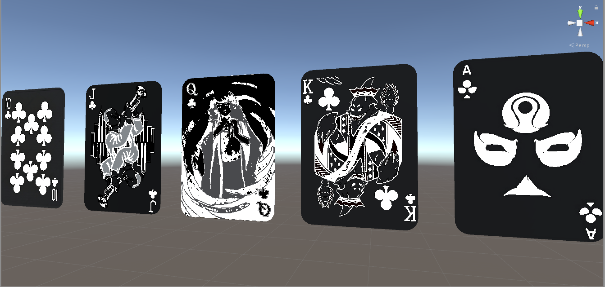
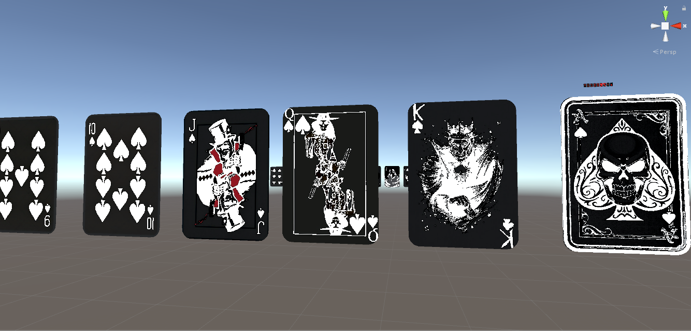
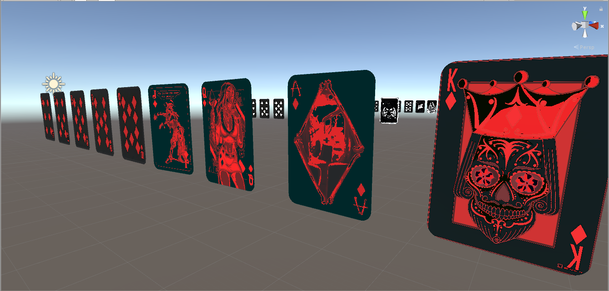

## bura card game written on Unity 3D

This is the first person multiplayer card gme bura. whe game is played between two people. 
This is a 5 card version of russian game bura (or Thirty One), you can
see rules [**here**](https://en.wikipedia.org/wiki/Bura_(card_game)).

### how to play

after both players join the lobby, the game will start shortly.
The player to act will be notified by the system.
the game will go on untill one of the players reaches eleven points.
olso each player has 30 second time limit to make a play
no time bank available.

controlls:

* You can choose cards with ***[Space]*** + ***[Mouse Wheel]***, then ***[Left Click]*** to make a play.
* You can your around the cursor to look areound the room.
* you can hover mouse on opopnents cards to choose which card you are trying to beat.

### Screen shots from a game:

here are some images for visual presentation.

#### the lobby

in a lobby you choose a room name and click create match to create a match where two players can play.
you also have an option to pick which malute option you will play with.

If you are trying to joine some other player's room you should choose it from available room list in the
item lit below:

just click join to connect to the game room.

#### GamePlay

Here are some screenshots from gameplay, As it was mentioned above, it is from a first peron perspective: 

#### Custom game cards:

As you noticed in the screenshot section the cards are quite different from regular game cards.
Their design were made with custom images and Unity Shaders to give them sharper look.

Here are some of their screens up closer:

Hearts.

Clubs.

Spades.

Diamonds.

#### Contributions

You can feel free to contribute to this project by making a pull request.
